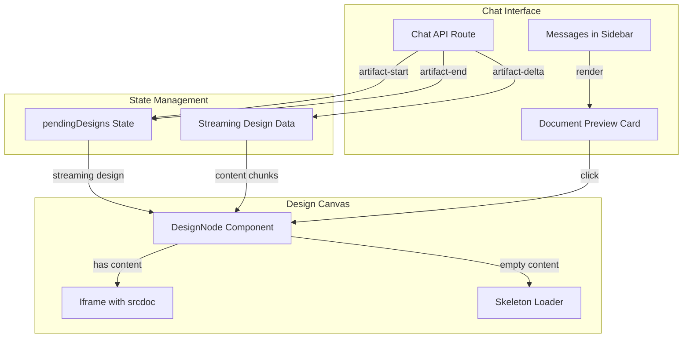

# Design Document: Live HTML Streaming

## Overview

This design enhances Niana's existing design generation system to support live HTML streaming. The implementation builds on the existing infrastructure:
- Uses the existing `DesignNode` component's iframe for live HTML rendering
- Uses the existing `pendingDesigns` state for tracking streaming designs
- Adds a new `DocumentPreviewCard` component for inline chat previews (like ai-chatbot)
- Modifies the Chat API to stream HTML content progressively

## Architecture



## Components and Interfaces

### 1. Enhanced SSE Event Types

```typescript
// Niana/app/(auth)/api/chat/route.ts - Updated event types

interface ArtifactStartEvent {
  type: "artifact-start";
  artifactId: string;
  title: string;
}

interface ArtifactDeltaEvent {
  type: "artifact-delta";
  artifactId: string;
  content: string;  // HTML chunk
}

interface ArtifactEndEvent {
  type: "artifact-end";
  artifactId: string;
  title: string;
  content: string;  // Final complete content
}

// Existing events
interface TextEvent {
  type: "text";
  content: string;
}

interface DoneEvent {
  type: "done";
}

interface ErrorEvent {
  type: "error";
  message: string;
}

type SSEEvent = TextEvent | ArtifactStartEvent | ArtifactDeltaEvent | ArtifactEndEvent | DoneEvent | ErrorEvent;
```

### 2. Document Preview Card Component

```typescript
// Niana/components/document-preview-card.tsx

interface DocumentPreviewCardProps {
  artifactId: string;
  title: string;
  content: string;
  isStreaming: boolean;
  onClick: (artifactId: string) => void;
}

export function DocumentPreviewCard({
  artifactId,
  title,
  content,
  isStreaming,
  onClick,
}: DocumentPreviewCardProps) {
  return (
    <div 
      className="w-full max-w-md cursor-pointer rounded-2xl border overflow-hidden"
      onClick={() => onClick(artifactId)}
    >
      {/* Header */}
      <div className="flex items-center justify-between p-4 border-b bg-muted">
        <div className="flex items-center gap-3">
          {isStreaming ? (
            <Loader2 className="h-4 w-4 animate-spin text-muted-foreground" />
          ) : (
            <FileIcon className="h-4 w-4 text-muted-foreground" />
          )}
          <span className="font-medium text-sm">{title || 'Generating design...'}</span>
        </div>
        <FullscreenIcon className="h-4 w-4 text-muted-foreground" />
      </div>
      
      {/* Content */}
      <div className="h-64 overflow-hidden bg-muted">
        {isStreaming && !content ? (
          <InlineDocumentSkeleton />
        ) : (
          <MiniHtmlPreview content={content} />
        )}
      </div>
    </div>
  );
}
```

### 3. Inline Document Skeleton

```typescript
// Niana/components/inline-document-skeleton.tsx

export function InlineDocumentSkeleton() {
  return (
    <div className="flex w-full flex-col gap-4 p-8 pt-4">
      <div className="h-4 w-48 animate-pulse rounded-lg bg-muted-foreground/20" />
      <div className="h-4 w-3/4 animate-pulse rounded-lg bg-muted-foreground/20" />
      <div className="h-4 w-1/2 animate-pulse rounded-lg bg-muted-foreground/20" />
      <div className="h-4 w-64 animate-pulse rounded-lg bg-muted-foreground/20" />
      <div className="h-4 w-40 animate-pulse rounded-lg bg-muted-foreground/20" />
      <div className="h-4 w-36 animate-pulse rounded-lg bg-muted-foreground/20" />
      <div className="h-4 w-64 animate-pulse rounded-lg bg-muted-foreground/20" />
    </div>
  );
}
```

### 4. Mini HTML Preview Component

```typescript
// Niana/components/mini-html-preview.tsx

interface MiniHtmlPreviewProps {
  content: string;
}

export function MiniHtmlPreview({ content }: MiniHtmlPreviewProps) {
  // Wrap partial HTML in valid document structure
  const wrappedContent = useMemo(() => {
    if (!content) return '';
    
    if (content.includes('<html') || content.includes('<!DOCTYPE')) {
      return content;
    }
    
    return `
      <!DOCTYPE html>
      <html>
        <head>
          <meta charset="UTF-8">
          <style>
            body { 
              font-family: system-ui, sans-serif; 
              margin: 0; 
              padding: 8px;
              transform: scale(0.5);
              transform-origin: top left;
              width: 200%;
            }
          </style>
        </head>
        <body>${content}</body>
      </html>
    `;
  }, [content]);

  return (
    <iframe
      srcDoc={wrappedContent}
      className="w-full h-full border-0 pointer-events-none"
      sandbox="allow-scripts"
      title="Preview"
    />
  );
}
```

### 5. Updated Streaming Design State

```typescript
// In Niana/app/(design)/design/[id]/page.tsx

// Enhanced Design type to support streaming content
interface StreamingDesign extends Design {
  streamingContent: string;  // Accumulated content during streaming
}

// State for tracking streaming designs
const [streamingDesigns, setStreamingDesigns] = useState<Map<string, StreamingDesign>>(new Map());

// Handler for artifact-start event
const handleArtifactStart = (artifactId: string, title: string) => {
  setStreamingDesigns(prev => {
    const next = new Map(prev);
    next.set(artifactId, {
      _id: `streaming-${artifactId}`,
      artifact_id: artifactId,
      title,
      content: '',
      streamingContent: '',
      status: 'streaming',
    });
    return next;
  });
};

// Handler for artifact-delta event
const handleArtifactDelta = (artifactId: string, chunk: string) => {
  setStreamingDesigns(prev => {
    const next = new Map(prev);
    const existing = next.get(artifactId);
    if (existing) {
      next.set(artifactId, {
        ...existing,
        streamingContent: existing.streamingContent + chunk,
        content: existing.streamingContent + chunk,  // Update content for iframe
      });
    }
    return next;
  });
};

// Handler for artifact-end event
const handleArtifactEnd = async (artifactId: string, title: string, content: string) => {
  // Save to database
  await createDesign({
    project_id: projectId,
    artifact_id: artifactId,
    title,
    content,
  });
  
  // Remove from streaming state
  setStreamingDesigns(prev => {
    const next = new Map(prev);
    next.delete(artifactId);
    return next;
  });
};
```

### 6. Chat API Streaming Enhancement

```typescript
// Niana/app/(auth)/api/chat/route.ts - Modified tool call handling

// When processing create_artifact tool call
if (toolCall.name === "create_artifact") {
  const createArgs = args as CreateArtifactArgs;
  
  // Send artifact-start immediately
  controller.enqueue(
    encoder.encode(
      `data: ${JSON.stringify({
        type: "artifact-start",
        artifactId: createArgs.id,
        title: createArgs.title,
      })}\n\n`
    )
  );
  
  // Stream content in chunks
  const content = createArgs.content;
  const chunkSize = 150;  // ~150 characters per chunk
  
  for (let i = 0; i < content.length; i += chunkSize) {
    const chunk = content.slice(i, i + chunkSize);
    controller.enqueue(
      encoder.encode(
        `data: ${JSON.stringify({
          type: "artifact-delta",
          artifactId: createArgs.id,
          content: chunk,
        })}\n\n`
      )
    );
    
    // Small delay to simulate streaming (optional, for visual effect)
    await new Promise(resolve => setTimeout(resolve, 10));
  }
  
  // Send artifact-end with complete content
  controller.enqueue(
    encoder.encode(
      `data: ${JSON.stringify({
        type: "artifact-end",
        artifactId: createArgs.id,
        title: createArgs.title,
        content: createArgs.content,
      })}\n\n`
    )
  );
}
```

## Data Models

### SSE Event Types

```typescript
type SSEEventType = 
  | 'text'           // Regular text message
  | 'artifact-start' // Artifact generation started
  | 'artifact-delta' // HTML content chunk
  | 'artifact-end'   // Artifact generation complete
  | 'done'           // Stream complete
  | 'error';         // Error occurred
```

### Streaming Design State

```typescript
interface StreamingDesign {
  artifact_id: string;
  title: string;
  content: string;           // Current accumulated content (for iframe)
  streamingContent: string;  // Same as content, for tracking
  status: 'streaming' | 'idle';
}
```


## Correctness Properties

*A property is a characteristic or behavior that should hold true across all valid executions of a system—essentially, a formal statement about what the system should do. Properties serve as the bridge between human-readable specifications and machine-verifiable correctness guarantees.*

### Property 1: Content Chunking

*For any* HTML content string longer than the chunk size threshold (150 characters), the Chat API SHALL send multiple artifact-delta events, where the concatenation of all delta content chunks equals the original content.

**Validates: Requirements 1.1, 1.3, 4.2, 4.4**

### Property 2: Event Ordering

*For any* artifact generation stream, the artifact-start event SHALL be sent before any artifact-delta events, and artifact-end SHALL be sent after all artifact-delta events.

**Validates: Requirements 1.2, 4.3**

### Property 3: Content Accumulation

*For any* sequence of artifact-delta events for a given artifactId, the streaming design's content SHALL equal the concatenation of all delta content values in order of receipt.

**Validates: Requirements 3.3**

### Property 4: Document Preview Conditional Rendering

*For any* artifact state, the DocumentPreviewCard SHALL render InlineDocumentSkeleton when isStreaming is true and content is empty, and SHALL render MiniHtmlPreview when content is non-empty.

**Validates: Requirements 2.3, 2.5**

### Property 5: Skeleton Display Until Content

*For any* streaming design, the DesignNode SHALL display the skeleton loader while content is empty, and SHALL display the iframe with content once the first chunk arrives.

**Validates: Requirements 1.6**

### Property 6: Streaming State Initialization

*For any* artifact-start event, the system SHALL create a new streaming design entry with the provided artifactId, title, and empty content string.

**Validates: Requirements 3.2**

### Property 7: Artifact End Contains Complete Content

*For any* artifact-end event, the content field SHALL contain the complete HTML content (equal to concatenation of all delta chunks).

**Validates: Requirements 4.5**

## Error Handling

### Stream Errors

| Error Condition | Handling Strategy |
|----------------|-------------------|
| Network disconnection during stream | Send error event, mark design as failed |
| Invalid artifact event format | Log warning, skip event, continue processing |
| Missing artifactId in delta event | Log error, skip event |
| Database save failure on artifact-end | Retry once, then show error toast |

### API Error Events

```typescript
// Error event format
interface ErrorEvent {
  type: 'error';
  message: string;
  artifactId?: string;  // Optional, if error is artifact-specific
}

// Example error handling in stream
if (error) {
  controller.enqueue(
    encoder.encode(`data: ${JSON.stringify({ 
      type: 'error', 
      message: error.message,
      artifactId: currentArtifactId,
    })}\n\n`)
  );
}
```

### Client-Side Error Recovery

```typescript
// In SSE event handler
if (event.type === 'error') {
  // Remove from streaming state
  setStreamingDesigns(prev => {
    const next = new Map(prev);
    if (event.artifactId) {
      next.delete(event.artifactId);
    }
    return next;
  });
  
  toast.error('Failed to generate design: ' + event.message);
}
```

## Testing Strategy

### Unit Tests

Unit tests verify specific examples and edge cases:

1. **DocumentPreviewCard Tests**
   - Renders skeleton when streaming with no content
   - Renders preview when streaming with content
   - Renders preview when not streaming
   - Shows loader icon when streaming
   - Shows file icon when not streaming
   - Calls onClick with artifactId when clicked

2. **InlineDocumentSkeleton Tests**
   - Renders correct number of placeholder lines
   - Has animate-pulse class on elements

3. **MiniHtmlPreview Tests**
   - Wraps partial HTML in valid document structure
   - Passes through complete HTML documents unchanged

4. **SSE Event Handler Tests**
   - Creates streaming design on artifact-start
   - Appends content on artifact-delta
   - Saves and clears on artifact-end
   - Handles error events gracefully

### Property-Based Tests

Property-based tests verify universal properties across all inputs using **fast-check** library.

Configuration:
- Minimum 100 iterations per property test
- Each test tagged with: **Feature: live-html-streaming, Property {number}: {property_text}**

**Property Tests to Implement:**

1. **Content Chunking Property**
   - Generate random HTML strings of various lengths
   - Verify content > 150 chars produces multiple delta events
   - Verify concatenation of chunks equals original

2. **Event Ordering Property**
   - Generate random artifact streams
   - Verify artifact-start always comes first
   - Verify artifact-end always comes last

3. **Content Accumulation Property**
   - Generate random sequences of delta events
   - Verify final accumulated content equals concatenation

4. **Conditional Rendering Property**
   - Generate random combinations of isStreaming and content
   - Verify correct component is rendered

### Integration Tests

1. **End-to-End Streaming Flow**
   - Send message that triggers artifact creation
   - Verify artifact-start event received
   - Verify multiple artifact-delta events received
   - Verify artifact-end event received
   - Verify design saved to database

2. **Live Iframe Update Flow**
   - Start artifact stream
   - Verify skeleton shows initially
   - Send delta events
   - Verify iframe updates with accumulated content
